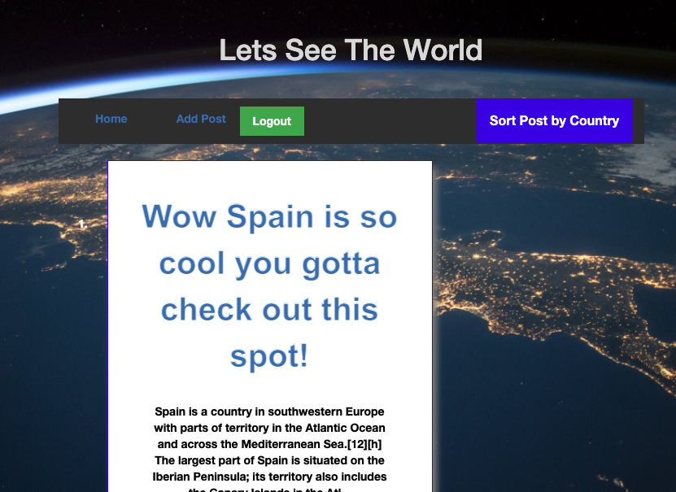

# Group-3-FullStack
Shafat, Tsira, and Will Full Stack Project 

 ## Description

An app for travelers to share fun ideas with one another. 

## Click image to be taken to live application on Heroku

## Table of Contents

  * [Installation](#installation)

  * [Usage](#usage)

  * [License](#license)

  * [Contributors](#contributors)

  * [Questions](#questions)

  ## Installtion
  A number of node packages were used for this project and are listed out as follows; bcrpyt, connection-session-sequelize, dotenv, express-handlebars, express-session, mysql2, and sequelize. To run this project on a local machine, copy the code and install these packages. You can then run nodes/seeds.index.js to populate the app with data, and npm start to run it on the localhost. 

  ## Usage
  This travel blog was created so that those struck with wanderlust could share fun stories and ideas with one another about their travels. Anyone can view the posts made on the blog, but one must sign in to add posts and leave comments. 

  ## License
  This app is licensed under the MIT license.

  ## Contributors
  Contributors: Tsira [(@KvTsira)](https://github.com/KvTsira), Shafat [(@srahman9)](https://github.com/srahman9), Will [(@wyork63)](https://github.com/wyork63)

  ## Questions 
  Please contact Will at w.york63@gmail.com if there are any questions about this project. 

